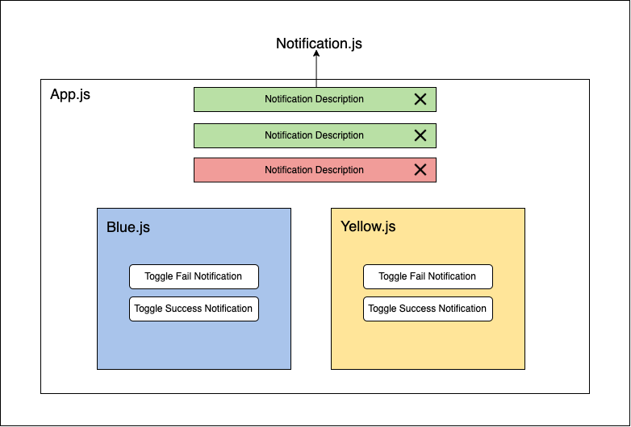

# Redux App - Push Notifications

# Actions
> Actions: the WHAT 

Actions are a playload of information that send data from the app to the Redux store, using `store.dispatch()`.

Actions must have a `type` property that indicates the type of action being performed. Types should typically be defined as
string constants.

Once your app is large enough, you may want to move them into a separate module. 

### Our App
For our app the actions are `addNotification` and `removeNotification` and they will be use to add and remove notifications form the app's store.