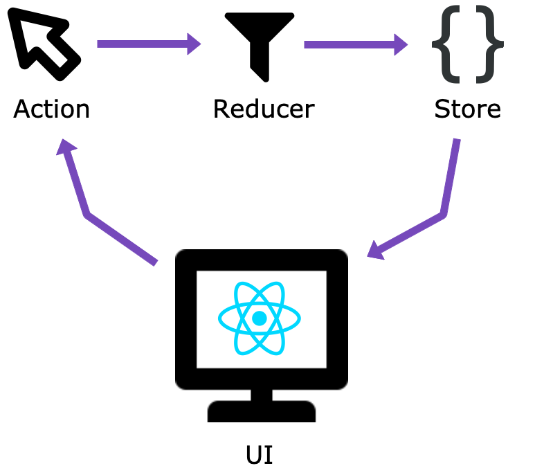

# What is Redux – Understanding Redux by building a push notification app

<p align="center">
    
</p>

## Introduction

When I first learned React a year ago, nearly all the React courses were titled "React and Redux crash-course" or "Learn React and Redux" so I thought that in order to learn React, I should learn Redux... But that was not the case, when I started making client projects with React I noticed that I didn't need Redux, the projects were mostly small web apps or websites and I was doing a lot of things with React without a state management library. That was until I worked on a really big project that already used Redux, it was time for me to relearn Redux!

## WTH is Redux?

Redux is a popular JavaScript library for managing the state of an app. A state is what holds data that will be used in the UI-elements. It can hold information fetched from an API call, or any backend or local files (for example the list of users, the name of the user, a list of tasks in a todo app...). In React, a component will rerender when its state change. Redux enable usage of a global state object that could be use thought all the app and makes it easier to manage all the app's states.

In this article, I am going to explain the building blocks of Redus while coding an app. The app consist of two components (`Blue.js` and `Yellow.js`) having buttons that triggers a push notification. The push notification will be displayed in the main component `App.js`. I think this is a good example to explore how to create, modify and use a global state object in a React app using Redux.

The following is a mockup of the app we are going to build:


## Notes

- I'm assuming that you have a solid understanding of JavaScript, CSS, NodeJS.
- I'm assuming you have basic knowledge of git.
- For simplicity, you will use an already created skeleton and then add the Redux part to it.
- I am using yarn, but feel free to use npm if you want.
- The full code is [here](https://github.com/simonachkar/redux-app)

## Ready? Set. Code!

First of all clone this [repo](https://github.com/simonachkar/redux-app) and then checkout to the `skeleton` branch

```
git clone https://github.com/simonachkar/redux-app.git
cd redux-app
git checkout skeleton
```

Feel free to explore the skeleton (you can always switch back to the master branch with `git checkout master`). The app is simple it has two blocks (Blue and Yellow), a notification component and simple styling using CSS.

Next, we need to install the libraries.

```
yarn add redux react-redux
```

Now, we are going to talk a little bit about Redux building blocks and what makes Redux... Redux. There are three building blocks:

1. Actions
1. Reducers
1. Store



### Actions

> Actions: the WHAT

Actions are a playload of information that send data from the app to the Redux store, using `store.dispatch()`.

Actions must have a `type` property that indicates the type of action being performed. Types should typically be defined as
string constants.

Once your app is large enough, you may want to move them into a separate module.

#### Our App

For our app the actions are `addNotification` and `removeNotification` and they will be use to add and remove notifications form the app's store. Create a file in `src` called `actions.js` and add two arrow fuctions for adding and removing notificaitons.

To add a notification we need to indicate its text and its status. For simplicity, status will be a sting of either `"fail"` or `"success"`. _Don't forget the type property_.

```js
export const addNotification = (text, status) => {
  return {
    type: 'ADD_NOTIFICATION',
    text,
    status
  }
}
```

To remove a notification we just need its id (index).

```js
export const removeNotification = id => {
  return {
    type: 'REMOVE_NOTIFICATION',
    id
  }
}
```

### Reducers

> Reducers: the HOW

Reducers specify how the application's state changes in reponse to to the actions sent to the store.

In Redux, all the application state is stored as a single object. Note that a reducer is just a function. Its job is to compute the next state.

### Our app

Always keep in mind the shape of the app's state, for our app our state consist of a notification property that contains the array of push notifications.

```js
{
  notifications: [
    {
      text: '...',
      status: 'success'
    },
    {
      text: '...',
      status: 'fail'
    }
  ]
}
```

Create a file in `src` called `reducers.js` and add this method into it:

```js
const initialState = {
  notifications: []
}

export default (state = initialState, action) => {
  switch (action.type) {
    case 'ADD_NOTIFICATION':
      return {
        ...state,
        notifications: [
          ...state.notifications,
          {
            text: action.text,
            status: action.status
          }
        ]
      }
    case 'REMOVE_NOTIFICATION':
      return {
        ...state,
        notifications: state.notifications.filter((data, i) => i !== action.id)
      }
    default:
      return state
  }
}
```

Okay... Let's slow down a bit. Like I said before, **a reducer is just a function**! It takes the state and the action as arguments, then it modifies the state and returns the newly modified state according to the action `type`. If no state was passed (which will happen when starting the app), the state will equa;s the initialState (an object with an empty notifications array).

<h1 style="color: red">To be continued</h1>

## Store

So **actions** represents "what happens" and **reducers** represents "how it happens" as in how the state gets updated according to those actions.
The **store** is the object that brings them together. It **holds the app's state**, allow access to state via `getState()`, allow state update with `dispatch(action)`, registers and unregisters listeners with `subscribe(listener)` that will listen to a state change.
In a Redux app we just have ONE store.

> When you want to split your data handling logic, you'll use reducer composition instead of many stores.

## Data Flow

The data lifecycle in any Redux app follows **4 steps**:

1. You call `store.dispatch(action)`
1. The Redux store calls the reducer function you gave it
1. The root reducer may combine the output of multiple reducers into a single state tree (this does not apply to this app)
1. The Redux store saves the complete state tree returned by the root reducer

## React

Now we need to hook the store to React, and it's done in `index.js`, by wrapping the `<App />` component by the `<Provider>` component that takes `store` as prop.

```jsx
<Provider store={store}>
  <App />
</Provider>
```
