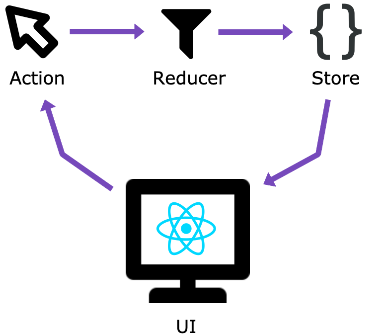

# What is Redux – Understanding Redux by building a push notification app

<p align="center">
  
  
</p>

## Introduction

When I first learned React a year ago, almosr all the React courses were titled "React and Redux crash-course" or "Learn React and Redux"... so I thought that to learn React, I should learn Redux. But that was not the case! When I started making client projects with React I noticed that I didn't need Redux, the projects were mostly small web apps or websites and I was doing a lot of things with stand-alone React without a state management library. That was until I worked on a really big project that already used Redux, it was time for me to re-learn Redux!

## WTH is Redux?

Redux is a popular JavaScript library for managing the state of an app. A _state_ is what holds data that will be used in the UI-elements. It can hold information fetched from an API call, or any backend or local files (for example the list of users, the name of the user, a list of tasks in a todo app...). In React, a component will rerender when its state change. 

Redux enable usage of a global state object that could be use thought all the app and makes it easier to manage all the app's states.

In this article, I am going to explain the building blocks of Redux while coding an app. The app consist of two components (`Blue.js` and `Yellow.js`) having buttons that triggers a push notification. The push notification will be displayed in the main component `App.js`. I think this is a good example to explore how to create, modify and use a global state object in a React app using Redux.

The following is a mockup of the app we are going to build:


## Notes

- I'm assuming that you have a solid understanding of JavaScript, CSS, and NodeJS.
- I'm assuming you have basic knowledge of `git`.
- For simplicity, you will use an already created skeleton and then add the Redux part to it.
- I am using `yarn`, but feel free to use `npm` if you want.
- The full code is [here](https://github.com/simonachkar/redux-app)

## Ready? Set. Code!

First of all clone this [repo](https://github.com/simonachkar/redux-app) and then checkout to the `skeleton` branch

```
git clone https://github.com/simonachkar/redux-app.git
cd redux-app
git checkout skeleton
```

Feel free to explore the skeleton (you can always switch back to the master branch with `git checkout master`). The app is simple it has two blocks (Blue and Yellow), a notification component and simple styling using CSS.

Next, we need to install the `redux` library  as well as the React binding library `react-redux`.

```
yarn add redux react-redux
```

Now, we are going to talk a little bit about Redux building blocks and what makes Redux, well... Redux! There are three building blocks:

1. Actions
1. Reducers
1. Store



### Actions

> Actions: the WHAT

Actions are a payload of information that sends data from the app to the Redux store, using `store.dispatch()`.

Actions must have a `type` property that indicates the type of action being performed. Types should typically be defined as
string constants.

Once your app is large enough, you may want to move them into a separate module.

#### Our App

For our app, the actions are `addNotification` and `removeNotification` and they will be used to add and remove notifications from the app's store. Create a file in `src` called `actions.js` and add two arrow functions for adding and removing notifications.

To add a notification we need to indicate its text and its status. For simplicity, status will be a string of either `"fail"` or `"success"`. _Don't forget the type property_.

```js
export const addNotification = (text, status) => {
  return {
    type: 'ADD_NOTIFICATION',
    text,
    status
  }
}
```

To remove a notification we just need its id (index).

```js
export const removeNotification = id => {
  return {
    type: 'REMOVE_NOTIFICATION',
    id
  }
}
```

### Reducers

> Reducers: the HOW

Reducers specify how the application's state changes in response to the actions sent to the store.

In Redux, all the application state is stored as a single object. Note that a reducer is just a function. Its job is to compute the next state.

#### Our app

Always keep in mind the shape of the app's state, for our app our state consist of a notification property that contains the array of push notifications.

```js
{
  notifications: [
    {
      text: '...',
      status: 'success'
    },
    {
      text: '...',
      status: 'fail'
    }
  ]
}
```

Create a file in `src` called `reducers.js` and add this method into it:

```js
const initialState = {
  notifications: []
}

export default (state = initialState, action) => {
  switch (action.type) {
    case 'ADD_NOTIFICATION':
      return {
        ...state,
        notifications: [
          ...state.notifications,
          {
            text: action.text,
            status: action.status
          }
        ]
      }
    case 'REMOVE_NOTIFICATION':
      return {
        ...state,
        notifications: state.notifications.filter((data, i) => i !== action.id)
      }
    default:
      return state
  }
}
```

Okay... Let's slow down a bit. Like I mentioned before, **a reducer is just a function**! It takes the state and the action as arguments, then it modifies it and returns the newly modified state according to the `type` of the action. If no state was passed (which will happen when starting the app), the state will equal the `initialState` (an object with an empty notifications array).

The reducer function contains a switch statement that checks the action `type`. If `addNotification` was called, then the action is of type `'ADD_NOTIFICATION'` and what happens here is that the state is returned with the addition of the new notification, we get the information of the notification from the action (`action.text` and `action.status`) – remember that on `addNoticfication` the action returns an object containing `type`, `text` and `status` –

> The **three dots operator** `...` is a featured introduced in ES6. It spreads the object to a new object, using all the objects properties (see [this article](https://medium.com/@oprearocks/what-do-the-three-dots-mean-in-javascript-bc5749439c9a) for more info)

When `removeNotification` is called, then the action is of type `'REMOVE_NOTIFICATION'` and the notification with the correspondent id (`action.id`) will be removed with the [`filter` funtion](https://developer.mozilla.org/en-US/docs/Web/JavaScript/Reference/Global_Objects/Array/filter).

### Store

So **actions** represents "what happens" and **reducers** represents "how it happens" as in how the state gets updated according to those actions.

The **store** is the object that brings them together. It **holds the app's state**, allows access to state via `getState()`, allows state update with `dispatch(action)`, registers and unregisters listeners with `subscribe(listener)` that will listen to a state change.

In a Redux app, we just have **ONE store**.

> When you want to split your data handling logic, you'll use reducer composition instead of many stores.

#### Our App

Adding the store is easy, go to `src/index.js` and add:

```js
const store = createStore(reducers)
```

Make sure to import `createStore` and `reducers`:

```js
import { createStore } from 'redux'
import reducers from './reducers'
```

### Wrapping the React app with Redux

Now we need to hook the store to React, and it's also done in `src/index.js`. We do that by wrapping the `<App />` component by the `<Provider>` component that takes `store` as prop. Now we can access the store throughout all of our React app.

```jsx
<Provider store={store}>
  <App />
</Provider>
```

### Using Redux and updating the store in the React App

#### Data Flow

The data lifecycle in any Redux app follows **4 steps**:

1. You call `store.dispatch(action)`
1. The Redux store calls the reducer function you gave it
1. The root reducer may combine the output of multiple reducers into a single state tree – \*_this does not apply to this app_
1. The Redux store saves the complete state tree returned by the root reducer

#### Our App

##### Accessing the Redux store

In our app, we need to hook up Redux to the components that will need access to the store. The React-Redux library provides us with a function `connect()` which will "connect" the component to the store and will also provide many useful optimizations to prevent unnecessary renders.

We need to access the notifications array in `App.js`, so if a notification gets added or removed the interface will update accordingly. We wrap the `App` component with `connect()` and we also need to define a special function called `mapStateToProps` that describes how to transform the current Redux store state into the props we want to pass to the `App`.

First import `connect` from `react-redux`:

```js
import { connect } from 'react-redux'
```

In our case, we need to get the notifications array from the current Redux store state, and we will pass it as a prop named `notifications`. Before the `export` statement in `src/App.js` write these line of code:

```js
const mapStateToProps = state => {
  const { notifications } = state
  return {
    notifications
  }
}

export default connect(mapStateToProps)(App)
```

And then pass it to the App function:

```js
function App({ notifications }) {
```

Or you can pass props (but make sure to use `props.notifications` if you want to use this approach):

```js
function App(props) {
```

Finally, we need to render the notification component if there are notifications to display, we pass the notification and the index `i` and then we render the component `<Notification>`:

```js
<div className='App'>
  {notifications.reverse().map((notification, i) => (
    <Notification key={i} text={notification.text} status={notification.status} index={i} />
  ))}
```

Don't forget to import the `Notification` component:

```js
import Notification from './components/Notification'
```

At the end the `App.js` component will look like this:

```js
// src/App.js

import React from 'react'
import { connect } from 'react-redux'

import './App.css'
import Blue from './components/Blue'
import Yellow from './components/Yellow'
import Notification from './components/Notification'

function App({ notifications }) {
  return (
    <div className='App'>
      {notifications.reverse().map((notification, i) => (
        <Notification key={i} text={notification.text} status={notification.status} index={i} />
      ))}
      <div className='App-Content'>
        <Blue />
        <Yellow />
      </div>
    </div>
  )
}

const mapStateToProps = state => {
  const { notifications } = state
  console.log(notifications)

  return {
    notifications
  }
}

export default connect(mapStateToProps)(App)
```

##### Adding a Notification

We will be toggling the buttons in the `Blue.js` and `Yellow.js` blocks to add a notification on click. For that, we need to call the action with `dispatch(action)`.

First, we need to connect the component to Redux. We're going to start with the `Blue.js` component. Import `connect` from `react-redux`:

```js
import { connect } from 'react-redux'
```

And wrap the compoent with `connect()` on export:

```js
export default connect()(Blue)
```

By wrapping the component it will give us access to the `dispatch` function, that will be accessible from the props, and `dispatch` will allow us to trigger the action (`addNoticaction`).

Pass `dispatch` to the arrow function:

```js
const Blue = ({ dispatch }) => {
```

Or you can pass props (but make sure to use `props.dispatch` if you want to use this approach):

```js
const Blue = (props) => {
```

And on button click, we want to trigger the `addNotification` action. So first import the action:

```js
import { addNotification } from '../actions'
```

And then add the `onClick` event attribute to both buttons passing the `dispatch(addNotification())` to it:

```js
<button onClick={() => dispatch(addNotification('Notification from the Blue Component', 'fail'))}>
  Toggle Fail Notification
</button>
<button onClick={() => dispatch(addNotification('Notification from the Blue Component', 'success'))}>
  Toggle Success Notification
</button>
```

At the end the file `src/components/Blue.js` will look like this:

```js
// src/components/Blue.js

import React from 'react'
import { connect } from 'react-redux'
import { addNotification } from '../actions'

const Blue = ({ dispatch }) => {
  return (
    <div className='block blue'>
      <button onClick={() => dispatch(addNotification('Notification from the Blue Component', 'fail'))}>
        Toggle Fail Notification
      </button>
      <button onClick={() => dispatch(addNotification('Notification from the Blue Component', 'success'))}>
        Toggle Success Notification
      </button>
    </div>
  )
}

export default connect()(Blue)
```

Do the same to `src/components/Yellow.js` for it to look like this:

```js
// src/components/Yellow.js

import React from 'react'
import { connect } from 'react-redux'
import { addNotification } from '../actions'

const Yellow = ({ dispatch }) => {
  return (
    <div className='block yellow'>
      <button onClick={() => dispatch(addNotification('Notification from the Yellow Component', 'fail'))}>
        Toggle Fail Notification
      </button>
      <button onClick={() => dispatch(addNotification('Notification from the Yellow Component', 'success'))}>
        Toggle Success Notification
      </button>
    </div>
  )
}

export default connect()(Yellow)
```

You can see Redux in action, run the app with `yarn start` (or `npm run start`) and click on the toggle buttons and watch how a new notification will be added to the view.

##### Removing a Notification

Now we need to remove a notification when clicking on the notification `X` button on the right. And where should we fire the action from? The `Notification` component itself!

We do the same thing as we did when adding a notification. Go to `src/components/Notification.js`, and import `connect` from `react-redux` and `removeNotification` from `actions.js.

```js
import { connect } from 'react-redux'
import { removeNotification } from '../actions'
```

Then, wrap `connect()` to the export statement:

```js
export default connect()(Notification)
```

Now add `dispatch` to the props:

```js
const Notification = ({ dispatch, text, status = 'success', index }) => {
```

Finally, add the `onClick` listener to the `<button>` that will call the `removeNotification` action:

```js
<button onClick={() => dispatch(removeNotification(index))}>X</button>
```

And we're done! The file will look like this at the end:

```js
// src/components/Notification.js

import React from 'react'
import { connect } from 'react-redux'
import { removeNotification } from '../actions'
import './Notification.css'

const Notification = ({ dispatch, text, status = 'success', index }) => {
  return (
    <div className={`notification ${status}`}>
      <p>{text}</p>
      <button onClick={() => dispatch(removeNotification(index))}>X</button>
    </div>
  )
}

export default connect()(Notification)
```
